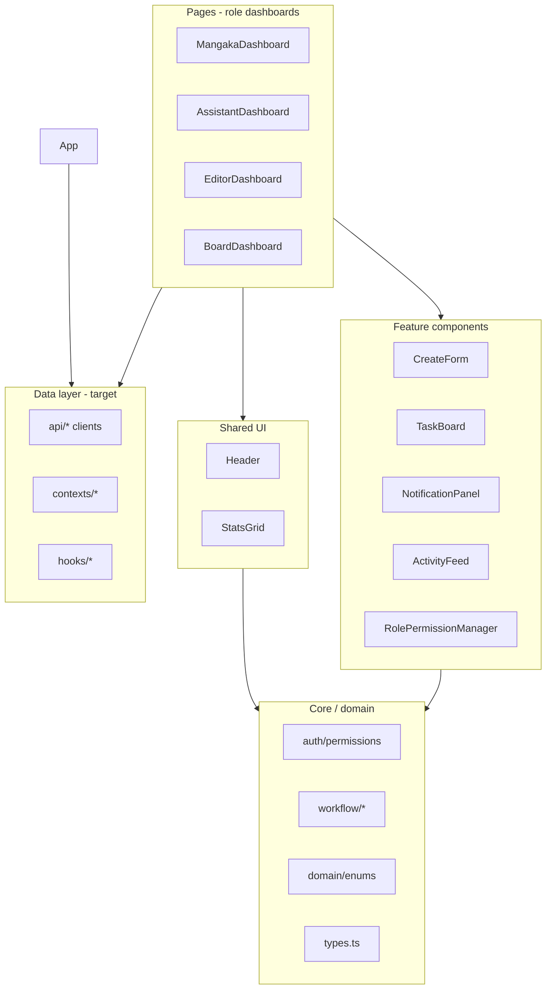

# 5. Component Architecture

## Layer diagram



## Component catalog

| Component | Responsibility | Props contract |
|-----------|----------------|--------------|
| `Header` | Auth, backend URL, role switch | Connection + user handlers |
| `StatsGrid` | Aggregate KPI cards | `seriesList`, `chapters`, `tasks` |
| `CreateForm` | Proposal / chapter / task creation | Tabs from `RolePermissions.createFormTabs` |
| `TaskBoard` | Kanban, reviews, ratings, chapters | Filtered by role tabs |
| `NotificationPanel` | In-app inbox | `notifications`, mark-read handlers |
| `ActivityFeed` | Audit log stream | `logs`, clear |
| `RolePermissionManager` | Demo RBAC editor | localStorage overlay |

## Planned feature components

| Component | Role | Description |
|-----------|------|-------------|
| `MangaPageCanvas` | Editor, Mangaka | Image + % overlay for annotations |
| `AnnotationMarker` | Editor | Pin, thread, resolve state |
| `RegionAssignTool` | Mangaka | Drag rect → `POST /api/tasks` |
| `RankingTable` | Board, Mangaka | Top 20 with tier badges |
| `SurveyEntryForm` | Board | Four metric inputs + recalc trigger |
| `VotePanel` | Board | ACCEPT/REJECT + schedule |
| `IncomeChart` | Assistant | Monthly earnings from API |
| `WorkflowStepper` | All | Visual `proposal_status` / `production_status` |

## Type contracts

- **`DashboardData`**: read-only collections for a dashboard.
- **`DashboardHandlers`**: imperative actions (create, review, vote).
- Split into context providers to avoid prop drilling (see [state-management.md](./state-management.md)).

## Annotation system (UI design)

```
MangaPageCanvas
  ├── 
  ├── SVG layer (markers)
  │     └── AnnotationMarker (x%, y% from click)
  └── Toolbar (comment | revision | highlight)
```

Click handler:

```ts
function onCanvasClick(e: React.MouseEvent, imgRect: DOMRect) {
  const xPercent = ((e.clientX - imgRect.left) / imgRect.width) * 100;
  const yPercent = ((e.clientY - imgRect.top) / imgRect.height) * 100;
  onCreateAnnotation({ xPercent, yPercent, markerType, body });
}
```

## Artwork assignment (UI design)

```
RegionAssignTool
  ├── Page selector
  ├── Draggable/resizable rect (stored as %)
  ├── Assistant select + TaskType select
  └── Submit → onTaskCreate(payload)
```

## Styling conventions

- Tailwind v4 utility classes (see `src/index.css`).
- Zinc neutral palette, role accent via badges in `data.ts` (`getStatusBadgeColor`).
- Icons: `lucide-react`.

## Testing hooks (recommended)

- `data-testid` on workflow buttons (`submit-proposal`, `board-vote-weekly`).
- Pure functions: `rankingTierFromRank`, `inferWorkflowStatus`, ranking calculator.
