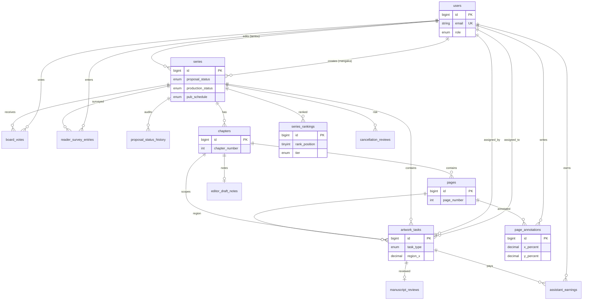

# 2. Entity-Relationship Diagram



## Cardinality notes

- One **tantou editor** per series (`tantou_editor_id` nullable until assigned).
- One **editor_draft_notes** row per chapter (upsert on save).
- One **manuscript_review** per artwork task (mangaka gate).
- **board_votes**: at most one vote per `(series_id, voter_id)`.
- **series_rankings**: at most 20 rows per `(ranking_type, ranked_on)` via application logic + CHECK.

## Annotation & region model

```
pages (image)
  └── page_annotations (x%, y%, marker_type, body)
  └── artwork_tasks (region_x/y/w/h %, task_type, assignee)
```

Percent coordinates keep annotations responsive across zoom levels in the React canvas overlay.
