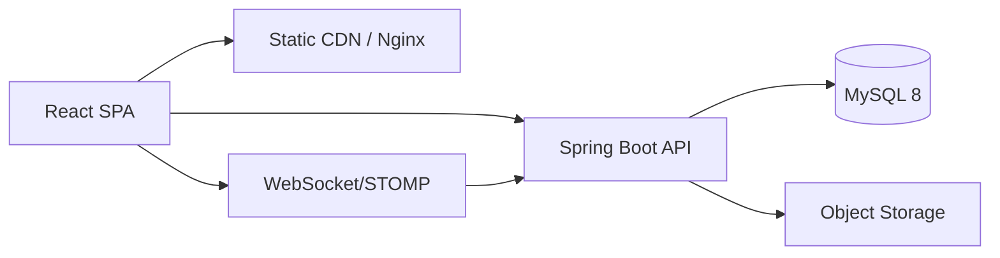

# 10. Production-Ready Code Architecture

## System context



## Security

| Concern | Implementation |
|---------|----------------|
| Authentication | JWT access (15m) + refresh token (7d, httpOnly cookie) |
| Authorization | Spring `@PreAuthorize` + method security aligned with [rbac-matrix.md](./rbac-matrix.md) |
| Passwords | BCrypt strength 12 |
| CORS | Allow FE origin only in production |
| Uploads | Pre-signed S3 URLs; virus scan hook |
| IDOR | Scope queries by `mangaka_id`, `assigned_to`, role |

## Ranking engine (server)

```java
@Service
public class RankingEngineService {
  private static final int MAX_SLOTS = 20;

  @Transactional
  public List<SeriesRanking> recalculate(RankingType type, LocalDate period) {
    List<ScoredSeries> scored = surveyRepo.aggregateForPeriod(type, period);
    List<SeriesRanking> top = scored.stream()
      .sorted(Comparator.comparing(ScoredSeries::score).reversed())
      .limit(MAX_SLOTS)
      .map(this::toRankingRow)
      .toList();
    rankingRepo.replaceForPeriod(type, period, top);
    cancellationService.evaluateBottomTier(top);
    eventPublisher.publishRatingCreated(type);
    return top;
  }
}
```

**Cancellation rules:**

| Rank | Tier | System action |
|------|------|---------------|
| 1–5 | HIGH | None |
| 6–12 | NORMAL | Monitor |
| 13–20 | LOW | Warning notification |
| Below 20 / unranked | — | Schedule review or cancellation workflow |

## Workflow service (server)

Centralize valid transitions:

```java
public void transitionProposal(Long seriesId, ProposalStatus to, User actor) {
  ProposalStatus from = seriesRepo.getStatus(seriesId);
  if (!ProposalTransition.isAllowed(from, to, actor.getRole())) {
    throw new InvalidTransitionException(from, to);
  }
  seriesRepo.updateStatus(seriesId, to);
  historyRepo.append(seriesId, from, to, actor.getId());
  notificationService.notifyTransition(seriesId, to);
}
```

Mirror rules in `src/workflow/seriesWorkflow.ts` for sandbox until API owns all transitions.

## Deployment

| Tier | Stack |
|------|-------|
| FE | `npm run build` → static files on Nginx / Vercel |
| BE | Spring Boot jar on Docker / Railway / EC2 |
| DB | MySQL managed (RDS) + Flyway migrations from `docs/sql/schema.sql` |
| Files | S3-compatible bucket for page images & drafts |

### Environment variables

**Frontend (`VITE_*`):**

```
VITE_API_BASE_URL=https://api.manga.example
VITE_WS_URL=wss://api.manga.example/ws
```

**Backend:**

```
SPRING_DATASOURCE_URL=jdbc:mysql://...
JWT_SECRET=...
JWT_EXPIRATION_MS=900000
RANKING_WEIGHT_VOTES=0.3
RANKING_WEIGHT_SALES=0.25
```

## Observability

- Structured logs (JSON) with `seriesId`, `actorId`, `transition`.
- Metrics: proposal funnel, avg time in `ARTWORK_IN_PROGRESS`, ranking recalc duration.
- Health: `/actuator/health`, `/actuator/info`.

## Evolution roadmap

| Phase | Deliverable |
|-------|-------------|
| **P0 (current)** | FE sandbox + optional Node/Mongo API; role dashboards |
| **P1** | Extract `api/` + contexts from `App.tsx`; fix routing |
| **P2** | Spring Boot + MySQL + Flyway; JWT parity with existing REST paths |
| **P3** | `MangaPageCanvas`, `RegionAssignTool`, survey → ranking engine |
| **P4** | Sub-routes per core page; remove localStorage RBAC in prod |
| **P5** | Reports PDF, earnings payroll export |

## Code quality gates

- `npm run lint` (TypeScript strict)
- ESLint + Prettier on FE
- Checkstyle + SpotBugs on BE
- Integration tests: proposal happy path, ranking cap at 20, RBAC 403 cases

## Relation to this repository

| Asset | Location |
|-------|----------|
| Working UI + sandbox | `src/` |
| RBAC | `src/auth/permissions.ts` |
| Workflow helpers | `src/workflow/` |
| Architecture docs | `docs/` |
| SQL DDL | `docs/sql/schema.sql` |
| Domain enums | `src/domain/enums.ts` |

**Recent fix:** `useNavigate` / `useLocation` wired in `MainApp` for role-based redirects.

Connect Spring Boot at `http://localhost:8080` (or keep Node at `:5000`) via Header → Backend URL; FE already sends `Authorization: Bearer`.
