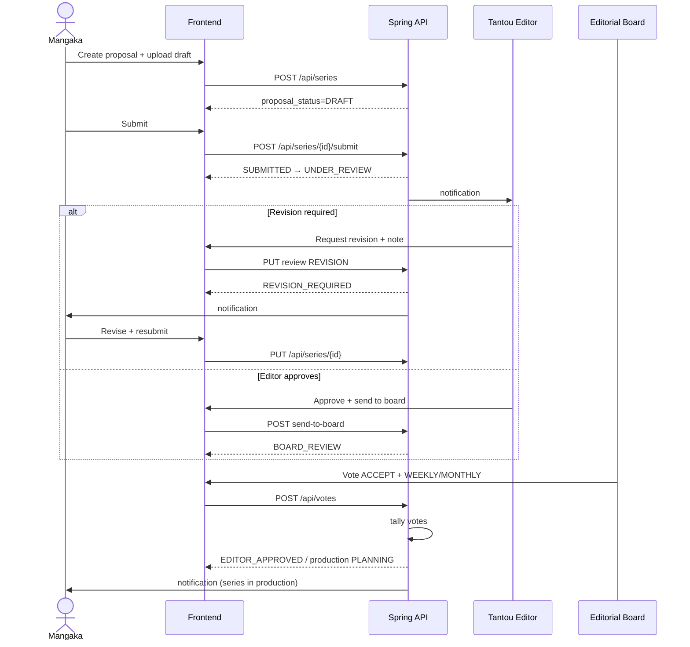
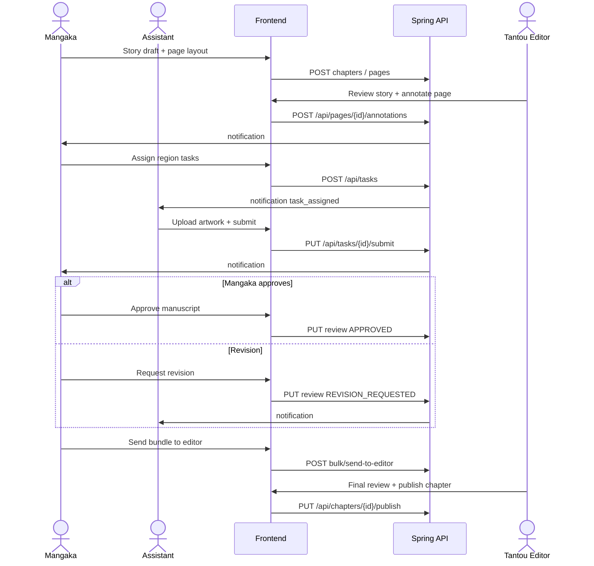
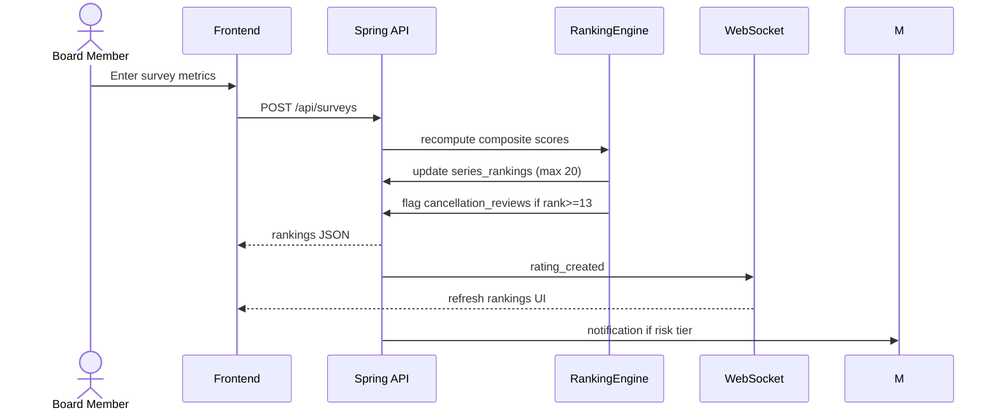
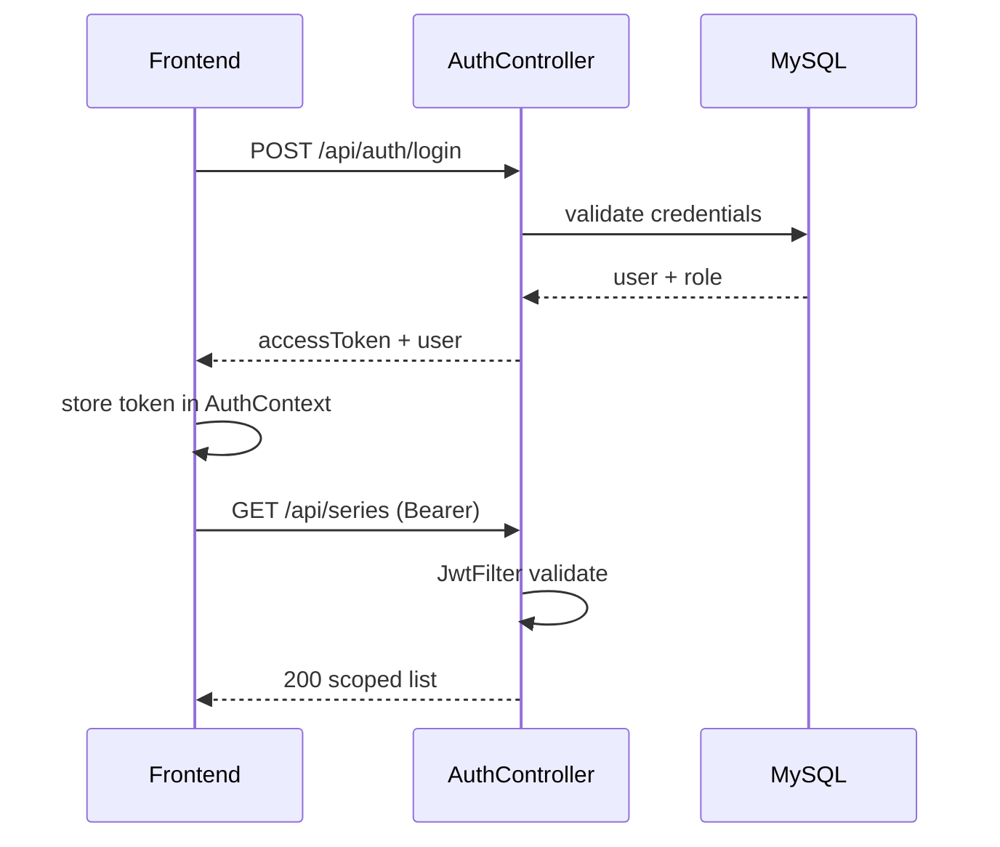

# 9. Sequence Diagrams

## Workflow 1 — Proposal phase

## Workflow 2 — Production phase

## Ranking recalculation

## JWT authentication (backend mode)

## Sandbox mode (no backend)

Same UI handlers write to `localStorage` and simulate socket delays with `setTimeout` — see `App.tsx` handlers with `[Sandbox Model]` logs.
