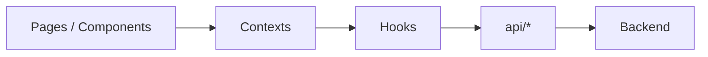

# 8. State Management Design

## Principles

1. **Server state** (series, chapters, tasks, rankings) — source of truth on API; cache on client.
2. **Auth state** — JWT in memory + `httpOnly` refresh cookie (target); today: `User.token` in React state + localStorage user snapshot.
3. **UI state** — tabs, modals, form drafts stay local to components.
4. **Workflow side effects** — notifications + activity logs derived from mutations.

## Current architecture (monolithic `App.tsx`)

```
MainApp state:
  users, currentUser, connectionMode, backendUrl
  seriesList, chapters, tasks, ranksList, votes
  manuscriptReviews, editorDraftNotes, notifications, logs
        ↓ props
  Role dashboards → CreateForm / TaskBoard / …
```

Persistence: `localStorage` keys `wdp301_*` for sandbox demo.

Handlers: `handleSeriesCreate`, `handleTaskSubmit`, workflow handlers (`handleEditorSendToBoard`, …).

## Target architecture



### AuthContext

```ts
interface AuthState {
  user: User | null;
  token: string | null;
  login(email, password): Promise<void>;
  logout(): void;
  switchRole(user: User): void; // sandbox only
}
```

### MangaWorkspaceContext

```ts
interface WorkspaceState {
  series: Series[];
  chapters: Chapter[];
  tasks: Task[];
  ranks: SeriesRank[];
  votes: Vote[];
  // actions
  refresh(): Promise<void>;
  proposeSeries(...): Promise<void>;
  transitionWorkflow(...): Promise<void>;
}
```

### NotificationContext

- Derived from API + optimistic inserts from workflow handlers.
- Socket subscription: append on `notification` event.

## Data fetching strategy

| Mode | Strategy |
|------|----------|
| Sandbox | `useState` + `INITIAL_*` from `data.ts` |
| Backend | `fetch` + Bearer token; optional React Query |

**Recommended:** `@tanstack/react-query` with keys:

```ts
['series', { role, userId }]
['chapters', seriesId]
['tasks', { assignedTo }]
['rankings', type]
```

Invalidate `['rankings']` after `POST /api/surveys`.

## Ranking engine (client preview vs server)

Sandbox swaps ranks in `handleRatingSubmit` (simplified). Production:

```ts
// services/rankingEngine.ts (pure function)
export function computeCompositeScore(entry: SurveyMetrics, weights: Weights): number;
export function assignRanks(scores: { seriesId: string; score: number }[]): RankSlot[];
```

Server runs authoritative recalc; client displays result from `GET /api/rankings`.

## Connection mode

```ts
type ConnectionMode = 'sandbox' | 'backend';
```

- `sandbox`: all handlers mutate local state.
- `backend`: handlers call API then `refresh()` or patch from response.

Extract from `App.tsx` into `hooks/useConnectionMode.ts`.

## Optimistic updates

| Action | Optimistic | Rollback on error |
|--------|------------|-------------------|
| Task submit | `status: DONE` | revert task |
| Mark notification read | `read: true` | revert |
| Board vote | append vote | remove vote |

## Local storage keys (sandbox)

| Key | Content |
|-----|---------|
| `wdp301_current_user` | Active user |
| `wdp301_series` | Series array |
| `wdp301_tasks` | Tasks |
| `wdp301_role_permissions` | RBAC overrides |
| `wdp301_conn_mode` | sandbox \| backend |

Clear on logout in production; keep only refresh token cookie.

## Permissions in UI

```ts
const permissions = usePermissions(currentUser?.role);
if (permissions.canAssignTask) { … }
```

`permissionsVersion` in `App.tsx` forces re-render when admin edits RBAC — replace with context subscription.
